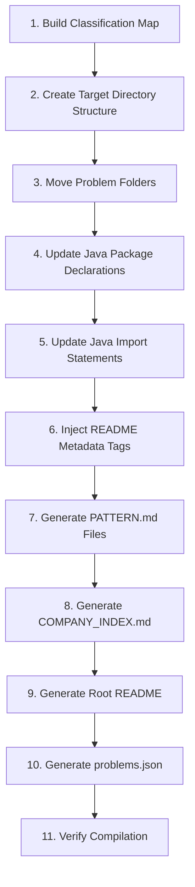

# Design Document: Repo Reorganization by Pattern

## Overview

This design describes the reorganization of a Java coding interview practice repository (~70 problems) from a flat company-based directory structure into a pattern-based hierarchy under `src/`. The current structure mixes top-level problem folders (e.g., `src/min_window_substring/`) with company-grouped folders (e.g., `src/facebook_practice/three_sum/`). The target structure groups every problem under one of 12 numbered pattern folders with optional sub-pattern folders, while preserving the shared `src/util/` package.

The reorganization is a file-system migration accompanied by:
- Java package declaration and import updates
- New documentation files (PATTERN.md per folder, COMPANY_INDEX.md, updated root README)
- A machine-readable `problems.json` index
- Metadata tag injection into each problem's README

### Key Design Decisions

1. **In-place migration over copy**: Problems are moved (git mv) rather than copied to preserve git history.
2. **Single-pass classification**: Each problem is classified once by its primary technique. A mapping table (defined below) drives the migration.
3. **Util stays put**: `src/util/` remains at its current path. Import statements change only because the importing file moves, not because util moves.
4. **Automation via shell script**: A Bash migration script handles the bulk move, package rewrite, and README metadata injection. Manual review follows for edge cases.

## Architecture

The reorganization is a one-time migration process, not a runtime system. The architecture is a pipeline of sequential steps:



### Directory Structure (Target State)

```
src/
├── util/                          # Unchanged
│   ├── TreeNode.java
│   ├── Trie.java
│   └── ...
├── 01_arrays_and_strings/
│   ├── PATTERN.md
│   ├── two_pointers/
│   │   └── three_sum/
│   │       ├── README.md
│   │       └── Solution.java
│   ├── sliding_window/
│   │   └── min_window_substring/
│   │       ├── README.md
│   │       └── Solution.java
│   └── prefix_sum/
├── 02_linked_lists/
│   ├── PATTERN.md
│   └── reorder_list/
├── 03_stacks_and_queues/
│   ├── PATTERN.md
│   ├── monotonic_stack/
│   └── basic/
├── 04_trees/
│   ├── PATTERN.md
│   ├── dfs/
│   ├── bfs/
│   └── construction/
├── 05_graphs/
│   ├── PATTERN.md
│   ├── dfs_bfs/
│   ├── topological_sort/
│   ├── union_find/
│   └── shortest_path/
├── 06_recursion_and_backtracking/
│   ├── PATTERN.md
│   ├── subsets_permutations/
│   └── constraint_based/
├── 07_dynamic_programming/
│   ├── PATTERN.md
│   ├── memoization/
│   ├── bottom_up/
│   └── dp_on_trees/
├── 08_binary_search/
│   ├── PATTERN.md
│   └── first_and_last_position/
├── 09_heaps_and_priority_queues/
│   ├── PATTERN.md
│   └── merge_k_sorted/
├── 10_tries/
│   ├── PATTERN.md
│   └── design_search_autocomplete_system/
├── 11_design/
│   ├── PATTERN.md
│   └── lru_cache/
├── 12_greedy/
│   ├── PATTERN.md
│   └── jump_game/
problems.json
COMPANY_INDEX.md
README.md
```

## Components and Interfaces

### Component 1: Classification Map

A static mapping from each existing problem folder path to its target pattern/sub-pattern. This is the single source of truth for the migration.

**Interface**: A data structure (Bash associative array or JSON file) with entries:

```
source_path -> { pattern_folder, sub_pattern_folder (optional), difficulty, companies[], source_url }
```

Example entries:
```json
{
  "facebook_practice/three_sum": {
    "pattern": "01_arrays_and_strings",
    "subPattern": "two_pointers",
    "difficulty": "Medium",
    "companies": ["Facebook"],
    "sourceUrl": "https://leetcode.com/problems/3sum/"
  },
  "doordash/course_schedule_II": {
    "pattern": "05_graphs",
    "subPattern": "topological_sort",
    "difficulty": "Medium",
    "companies": ["DoorDash"],
    "sourceUrl": "https://leetcode.com/problems/course-schedule-ii/"
  }
}
```

### Component 2: Migration Script (`migrate.sh`)

A Bash script that:
1. Reads the classification map
2. Creates target directories
3. Moves problem folders via `git mv`
4. Rewrites Java `package` declarations using `sed`
5. Rewrites `import` statements for util references
6. Injects metadata header blocks into each problem README

**Key operations**:
- `git mv src/<old_path> src/<pattern>/<sub_pattern>/<problem_name>/`
- `sed -i 's/^package .*/package <new_package>;/' Solution.java`
- For util imports: no change needed since `util` stays at `src/util/` and Java source root is `src/`

### Component 3: README Metadata Injector

Adds a consistent metadata header block to each problem README. Format:

```markdown
# Problem Name

| Difficulty | Companies | Source |
|------------|-----------|--------|
| Medium     | Facebook  | [LeetCode](https://leetcode.com/problems/...) |

## Problem Statement
...
```

### Component 4: PATTERN.md Generator

Creates a PATTERN.md file for each of the 12 pattern folders. Each file follows a template:

```markdown
# Pattern Name

## Description
[What this pattern/data structure is]

## When to Apply
[Common signals in problem statements that suggest this pattern]

## Complexity Characteristics
[Typical time and space complexity]

## Sub-Patterns
[If applicable: description of each sub-pattern and relationship to parent]
```

### Component 5: COMPANY_INDEX.md Generator

Reads the classification map, groups problems by company, and generates an alphabetically sorted markdown file with links.

### Component 6: Root README Generator

Generates the top-level README with:
- Repository description and usage guide
- Table of contents following pattern folder numbering (01-12)
- Each problem listed as a checkbox link under its pattern
- Link to COMPANY_INDEX.md

### Component 7: problems.json Generator

Reads the classification map and outputs a JSON array. Each entry:

```json
{
  "name": "three_sum",
  "pattern": "01_arrays_and_strings",
  "subPattern": "two_pointers",
  "difficulty": "Medium",
  "companies": ["Facebook"],
  "path": "src/01_arrays_and_strings/two_pointers/three_sum",
  "sourceUrl": "https://leetcode.com/problems/3sum/"
}
```

### Component 8: Compilation Verifier

After migration, runs `javac` against all `.java` files under `src/` to confirm no broken package declarations or imports. Reports any failures for manual fix.

## Data Models

### Problem Classification Entry

```
ProblemEntry {
  name: string              // e.g., "three_sum"
  sourcePath: string        // e.g., "facebook_practice/three_sum"
  pattern: string           // e.g., "01_arrays_and_strings"
  subPattern: string?       // e.g., "two_pointers" (nullable)
  difficulty: enum(Easy, Medium, Hard)
  companies: string[]       // e.g., ["Facebook"]
  sourceUrl: string         // e.g., "https://leetcode.com/problems/3sum/"
  targetPath: string        // computed: src/{pattern}/{subPattern?}/{name}
}
```

### Pattern Folder Metadata

```
PatternMeta {
  id: string                // e.g., "01_arrays_and_strings"
  displayName: string       // e.g., "Arrays & Strings"
  description: string
  whenToApply: string
  complexity: string
  subPatterns: SubPatternMeta[]
}

SubPatternMeta {
  id: string                // e.g., "sliding_window"
  displayName: string       // e.g., "Sliding Window"
  description: string
}
```

### Java Package Path Derivation

The Java package declaration for a moved file is derived from its path relative to `src/`:

```
File: src/01_arrays_and_strings/two_pointers/three_sum/Solution.java
Package: 01_arrays_and_strings.two_pointers.three_sum
```

Note: Java package names starting with digits are technically valid but unconventional. Since this repo uses `package` declarations matching directory names and doesn't use a build tool like Maven/Gradle with strict conventions, this works. The existing pattern (e.g., `package facebook_practice.three_sum;`) already uses underscores and non-standard naming.

### Import Path Rules

| Scenario | Current Import | New Import | Action |
|----------|---------------|------------|--------|
| File imports from util | `import util.TreeNode;` | `import util.TreeNode;` | No change (util doesn't move) |
| File imports from another moved file | `import old_package.ClassName;` | `import new_package.ClassName;` | Update import |
| Util file imports nothing external | N/A | N/A | No change |

Since the grep search shows that cross-problem imports don't exist (files only import from `util` or `java.*`), the import update scope is limited: only `package` declarations need rewriting. Util imports remain valid because `util/` stays at `src/util/`.


## Correctness Properties

*A property is a characteristic or behavior that should hold true across all valid executions of a system — essentially, a formal statement about what the system should do. Properties serve as the bridge between human-readable specifications and machine-verifiable correctness guarantees.*

### Property 1: Complete Migration

*For any* problem folder that existed in the original repository structure, there SHALL exist exactly one corresponding problem folder in the new pattern-based structure, and no problem folders SHALL remain in the old flat/company-based locations.

**Validates: Requirements 2.1, 2.3**

### Property 2: Valid Placement

*For any* problem folder in the new structure, its parent path SHALL be a valid pattern folder or sub-pattern folder as defined in Requirement 1 (one of the 12 numbered pattern folders, optionally nested in a defined sub-pattern folder).

**Validates: Requirements 2.1**

### Property 3: Content Preservation

*For any* migrated problem folder, the Java solution file content (excluding the `package` declaration line) SHALL be byte-identical to the original, and the README content (excluding the injected metadata header block) SHALL be identical to the original.

**Validates: Requirements 2.4**

### Property 4: README Metadata Completeness

*For any* problem README in the new structure, it SHALL contain a metadata header block at the top of the file that includes: a difficulty tag with value in {Easy, Medium, Hard}, and a source URL (http/https link).

**Validates: Requirements 3.1, 3.2, 3.4**

### Property 5: Company Tag Presence for Company-Originated Problems

*For any* problem that originated from a company-specific folder (facebook_practice, doordash, goldman_sachs, microsoft_preparation, etc.), its README SHALL include a company tag identifying the originating company.

**Validates: Requirements 3.3**

### Property 6: PATTERN.md Required Sections

*For any* PATTERN.md file in the repository, it SHALL contain a description section, a "when to apply" section, and a complexity characteristics section.

**Validates: Requirements 4.2, 4.3, 4.4**

### Property 7: PATTERN.md Sub-Pattern Coverage

*For any* pattern folder that contains sub-pattern folders, its PATTERN.md SHALL mention each sub-pattern by name.

**Validates: Requirements 4.5**

### Property 8: Company Index Completeness

*For any* company tag that appears in any problem README, the COMPANY_INDEX.md SHALL list that company and include a link to every problem associated with it.

**Validates: Requirements 5.2, 5.3**

### Property 9: Company Index Alphabetical Order

*For any* two consecutive company headings in COMPANY_INDEX.md, the first SHALL be lexicographically less than or equal to the second.

**Validates: Requirements 5.4**

### Property 10: Root README Problem Coverage

*For any* problem folder in the repository, the root README SHALL contain a markdown checkbox entry (`- [ ]`) with a link to that problem.

**Validates: Requirements 6.2, 6.4**

### Property 11: problems.json Completeness and Validity

*For any* entry in problems.json, it SHALL be valid JSON and contain all required fields (`name`, `pattern`, `subPattern`, `difficulty`, `companies`, `path`, `sourceUrl`), and the `path` field SHALL correspond to an actual directory in the repository. The total number of entries SHALL equal the total number of problem folders.

**Validates: Requirements 7.2, 7.4**

### Property 12: Package Declaration Matches Directory Path

*For any* `.java` file under `src/`, the `package` declaration SHALL match the file's directory path relative to `src/` (with `/` replaced by `.`).

**Validates: Requirements 8.1**

### Property 13: All Imports Resolve

*For any* `import` statement in any `.java` file under `src/`, the imported package SHALL correspond to a valid class in the repository (either in `src/util/` or in another problem folder) or be a `java.*`/`javax.*` standard library import.

**Validates: Requirements 8.2, 8.3**

## Error Handling

### Migration Errors

| Error | Handling |
|-------|----------|
| Problem folder not in classification map | Script logs a warning and skips; manual classification required |
| Target directory already exists (name collision) | Script aborts the move for that problem and logs for manual resolution |
| `git mv` fails (uncommitted changes) | Script requires clean working tree before starting |
| Java file has no package declaration | Script logs warning; file is moved but package line is inserted |
| README has no LeetCode link in original | Metadata block uses placeholder `TBD` for sourceUrl |

### Compilation Errors

After migration, the verification step compiles all Java files. Failures are logged with file path and error message. Common causes:
- Package declaration mismatch (bug in sed pattern)
- Missing import (cross-problem reference that was missed)

These are fixed manually and the verifier is re-run.

### Edge Cases

- **Duplicate problem names across companies**: e.g., `facebook_practice/target_sum` and `microsoft_preparation/target_sum`. These are different folders and will both be migrated. If they land in the same pattern/sub-pattern, they keep their original folder names (which are identical), so one must be renamed (e.g., `target_sum_fb`, `target_sum_msft`) or placed in different sub-patterns.
- **Problems with multiple Java files**: e.g., `lru_cache/` has `LRUCache.java` and `Solution.java`. All files in the folder are moved together and all get package declarations updated.
- **Nested company folders**: `microsoft_preparation/` has 30+ problems. Each is classified independently.
- **Non-standard folders**: `geli_take_home/`, `amazon_oa_2020_Jul/`, `twitter_coding_challenge/` — these are treated as company-originated problems.

## Testing Strategy

### Unit Tests (Example-Based)

Unit tests verify specific structural outcomes:

1. **Directory structure exists**: Verify all 12 pattern folders and their sub-pattern folders exist (Requirements 1.1-1.8)
2. **PATTERN.md exists in each folder**: Verify all 12 files are present (Requirement 4.1)
3. **COMPANY_INDEX.md exists**: Verify file at root (Requirement 5.1)
4. **problems.json exists**: Verify file at root (Requirement 7.1)
5. **Root README structure**: Verify TOC lists all 12 patterns in order, contains link to COMPANY_INDEX.md, and has a description section (Requirements 6.1, 6.3, 6.5)
6. **Specific problem spot-checks**: Verify a handful of known problems landed in expected locations (e.g., `three_sum` → `01_arrays_and_strings/two_pointers/`)

### Property-Based Tests

Property-based tests use a PBT library (e.g., jqwik for Java, or a shell-based approach using file system enumeration) to verify universal properties across all problems.

Each property test runs a minimum of 100 iterations (where applicable — for file-system properties, the "iterations" are the full set of problems/files).

Configuration:
- **Library**: Since this is primarily a file-system migration verified by scripts, property tests will be implemented as shell scripts or a lightweight Java test harness using jqwik.
- **Minimum iterations**: 100 (for generated-input tests) or exhaustive (for file-system enumeration tests where the full set is ~70 problems).

Property test tags follow the format:
- `Feature: repo-reorganization-by-pattern, Property 1: Complete Migration`
- `Feature: repo-reorganization-by-pattern, Property 2: Valid Placement`
- etc.

**Property tests to implement:**

1. **Property 1 — Complete Migration**: Enumerate all original problem paths, verify each has a corresponding folder in the new structure and none remain in old locations.
2. **Property 2 — Valid Placement**: For each problem folder, verify its parent is a valid pattern/sub-pattern path.
3. **Property 3 — Content Preservation**: For each migrated problem, diff the Java file content (minus package line) against a stored snapshot.
4. **Property 4 — README Metadata Completeness**: For each problem README, parse and verify the metadata header block format, difficulty value, and source URL presence.
5. **Property 5 — Company Tag Presence**: For each problem from a known company folder, verify its README contains the company tag.
6. **Property 6 — PATTERN.md Required Sections**: For each PATTERN.md, verify it contains description, when-to-apply, and complexity sections.
7. **Property 7 — PATTERN.md Sub-Pattern Coverage**: For each pattern folder with sub-patterns, verify its PATTERN.md mentions all sub-pattern names.
8. **Property 8 — Company Index Completeness**: Collect all company tags from READMEs, verify each company+problem pair appears in COMPANY_INDEX.md.
9. **Property 9 — Company Index Alphabetical Order**: Extract company headings, verify sorted order.
10. **Property 10 — Root README Problem Coverage**: For each problem folder, verify a checkbox link exists in the root README.
11. **Property 11 — problems.json Completeness**: Parse JSON, verify field presence for each entry, verify path exists on disk, verify count matches problem count.
12. **Property 12 — Package Declaration Matches Path**: For each .java file, extract package declaration and verify it matches the directory path.
13. **Property 13 — All Imports Resolve**: For each import statement in each .java file, verify the target exists in the repo or is a standard library import.

### Test Execution Order

1. Run unit tests first (fast, structural checks)
2. Run property tests (exhaustive enumeration over all problems/files)
3. Run `javac` compilation check as final verification
