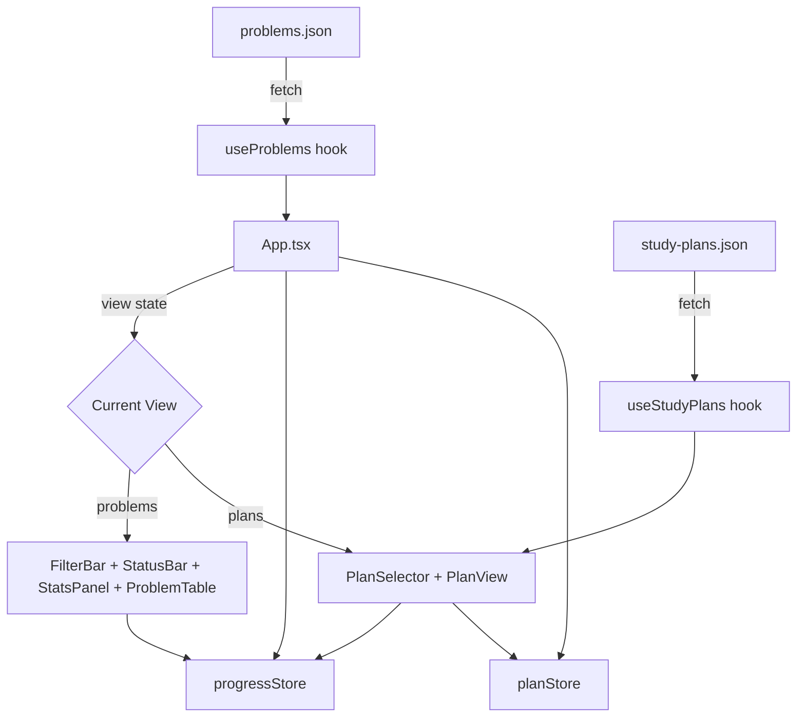

# Design Document: Study Plans

## Overview

Study Plans adds curated, structured problem sequences to AlgoForge. Users browse available plans, activate one, and work through its ordered sections at their own pace. Plans are defined in a static JSON file (`study-plans.json`) at the repo root, fetched at runtime like `problems.json`. Progress is tracked via the existing `progressStore`, and plan-specific state (active plan ID) is stored in a separate localStorage key via a new `planStore` module.

The feature introduces a view toggle in `App.tsx` — users switch between the existing problem table view and a new study plans view. No router is needed; a simple state variable controls which view is rendered. All existing state (filters, completion) is preserved across view switches.

### Key Design Decisions

1. **Shared progress store**: Plan completion piggybacks on the existing `progressStore` (keyed by problem name). No duplicate completion data.
2. **Separate plan state store**: Active plan ID lives in its own localStorage key (`study-plans-active`) via a new `planStore` module, keeping concerns separated.
3. **Validation at load time**: Invalid problem references, duplicate IDs, bad section orders, and empty sections are filtered out with console warnings — the app never crashes on bad data.
4. **No router**: A `view` state in `App.tsx` (`"problems" | "plans"`) toggles between views. This keeps the architecture simple and consistent with the existing pattern.
5. **Data-driven plans**: Adding a new plan to `study-plans.json` requires zero code changes.

## Architecture



### Data Flow

1. `useStudyPlans` fetches and parses `study-plans.json`, cross-references problem names against the loaded `ProblemEntry[]` from `useProblems`, and returns validated `StudyPlan[]`.
2. `App.tsx` holds `view` state and passes `completed` set + `onToggle` handler to both views.
3. `PlanSelector` displays available plans; on selection, `planStore.setActivePlan(id)` persists the choice.
4. `PlanView` renders sections for the active plan, reusing the same `completed` set and `onToggle` callback.
5. Toggling a problem in either view calls the same `handleToggle` in `App.tsx`, so both views stay in sync via React state.

## Components and Interfaces

### New Files

| File | Purpose |
|------|---------|
| `web/src/lib/planStore.ts` | localStorage persistence for active plan ID |
| `web/src/lib/studyPlanTypes.ts` | TypeScript types for study plan data |
| `web/src/lib/studyPlanLoader.ts` | Parsing, validation, and cross-referencing of plan JSON |
| `web/src/hooks/useStudyPlans.ts` | React hook to fetch and validate study plans |
| `web/src/components/PlanSelector.tsx` | Browse/select/deactivate study plans |
| `web/src/components/PlanView.tsx` | Display active plan sections with progress |
| `study-plans.json` | Plan data file at repo root |

### Component Interfaces

#### PlanSelector

```tsx
interface PlanSelectorProps {
  plans: StudyPlan[];
  activePlanId: string | null;
  onSelectPlan: (id: string) => void;
  onDeactivatePlan: () => void;
}
```

Renders a list of plan cards showing name, description, author, and tags. Highlights the active plan. Provides a "Deactivate" action on the active plan card.

#### PlanView

```tsx
interface PlanViewProps {
  plan: StudyPlan;
  problems: ProblemEntry[];
  completed: Set<string>;
  onToggle: (name: string) => void;
}
```

Renders the active plan's sections in order. Each section shows its focus description (if present), a list of problems with checkboxes, and a section completion indicator. An overall progress bar sits at the top.

### Module Interfaces

#### planStore

```typescript
interface PlanStore {
  getActivePlanId(): string | null;
  setActivePlan(id: string): void;
  clearActivePlan(): void;
  readonly isMemoryFallback: boolean;
}

function createPlanStore(): PlanStore;
```

Mirrors the `progressStore` pattern. Uses localStorage key `"study-plans-active"`. Falls back to in-memory if localStorage is unavailable.

#### studyPlanLoader

```typescript
interface LoadResult {
  plans: StudyPlan[];
  warnings: string[];
}

function loadStudyPlans(
  raw: unknown,
  validProblemNames: Set<string>
): LoadResult;
```

Pure function. Takes parsed JSON and a set of valid problem names. Returns validated plans and a list of warning messages. Handles:
- Filtering out plans with duplicate IDs (keeps first)
- Filtering out sections with `order < 1`
- Filtering out plans with empty sections arrays (after section filtering)
- Removing invalid problem name references from sections
- Type validation of all required fields

#### useStudyPlans

```typescript
interface UseStudyPlansResult {
  plans: StudyPlan[];
  loading: boolean;
  error: string | null;
}

function useStudyPlans(problems: ProblemEntry[]): UseStudyPlansResult;
```

Fetches `study-plans.json`, calls `loadStudyPlans` with the problem names set, logs warnings to console, returns validated plans.

### App.tsx Changes

```tsx
// New state
const [view, setView] = useState<"problems" | "plans">("problems");
const planStoreRef = useMemo(() => createPlanStore(), []);
const [activePlanId, setActivePlanId] = useState<string | null>(
  () => planStoreRef.getActivePlanId()
);
const { plans } = useStudyPlans(problems);

// View toggle handler
const handleSelectPlan = useCallback((id: string) => {
  planStoreRef.setActivePlan(id);
  setActivePlanId(id);
}, [planStoreRef]);

const handleDeactivatePlan = useCallback(() => {
  planStoreRef.clearActivePlan();
  setActivePlanId(null);
}, [planStoreRef]);
```

The render conditionally shows either the problem table view or the plans view based on `view` state. A nav element with two buttons toggles between views.


## Data Models

### StudyPlan Types (`studyPlanTypes.ts`)

```typescript
/** A single section within a study plan */
export interface PlanSection {
  order: number;
  focus?: string;
  problemNames: string[];
}

/** A complete study plan as stored in study-plans.json */
export interface StudyPlan {
  id: string;
  name: string;
  description: string;
  author: string;
  tags: string[];
  sections: PlanSection[];
}

/** Raw JSON shape before validation (used by loader) */
export interface RawPlanSection {
  order?: unknown;
  focus?: unknown;
  problemNames?: unknown;
}

export interface RawStudyPlan {
  id?: unknown;
  name?: unknown;
  description?: unknown;
  author?: unknown;
  tags?: unknown;
  sections?: unknown;
}
```

### study-plans.json Schema

```json
[
  {
    "id": "blind-75",
    "name": "Blind 75",
    "description": "The classic 75 problems for coding interview prep.",
    "author": "community",
    "tags": ["interview", "classic"],
    "sections": [
      {
        "order": 1,
        "focus": "Arrays & Hashing",
        "problemNames": ["Two Sum", "Contains Duplicate", "Valid Anagram"]
      },
      {
        "order": 2,
        "focus": "Two Pointers",
        "problemNames": ["Valid Palindrome", "3Sum"]
      }
    ]
  }
]
```

### localStorage Keys

| Key | Value | Module |
|-----|-------|--------|
| `study-tracker-completed` | `string[]` (JSON) | progressStore (existing) |
| `study-plans-active` | `string` (plan ID) | planStore (new) |

### Plan Progress Computation

Plan progress is computed on-the-fly from the `completed` set and the plan's problem names — no separate storage needed.

```typescript
function computePlanProgress(
  plan: StudyPlan,
  completed: Set<string>
): { completed: number; total: number; percentage: number } {
  const allNames = plan.sections.flatMap(s => s.problemNames);
  const done = allNames.filter(name => completed.has(name)).length;
  const total = allNames.length;
  return {
    completed: done,
    total,
    percentage: total === 0 ? 0 : Math.round((done / total) * 100),
  };
}

function isSectionComplete(
  section: PlanSection,
  completed: Set<string>
): boolean {
  return section.problemNames.length > 0 &&
    section.problemNames.every(name => completed.has(name));
}
```


## Correctness Properties

*A property is a characteristic or behavior that should hold true across all valid executions of a system — essentially, a formal statement about what the system should do. Properties serve as the bridge between human-readable specifications and machine-verifiable correctness guarantees.*

### Property 1: JSON Serialization Round-Trip

*For any* valid `StudyPlan` object, serializing it to JSON and parsing it back should produce an object deeply equal to the original.

**Validates: Requirements 8.1**

### Property 2: Schema Validation Accepts Valid and Rejects Invalid

*For any* JSON value, the `loadStudyPlans` function should return it as a valid `StudyPlan` if and only if it has all required fields (`id`, `name`, `description`, `author`, `tags`, `sections`) with correct types, and each section has `order` (number), `problemNames` (string array), and optionally `focus` (string).

**Validates: Requirements 1.1, 1.2, 7.1, 8.2, 9.2**

### Property 3: Cross-Reference Filtering

*For any* study plan and *for any* set of valid problem names, after loading, every `problemNames` entry in every section should be a member of the valid problem names set, and no valid problem name that was originally present should be removed.

**Validates: Requirements 1.3, 1.4**

### Property 4: Loader Validation Rules

*For any* array of raw study plan objects:
- If two plans share the same `id`, only the first occurrence should appear in the output.
- If a section has `order < 1`, it should be excluded from its plan's sections.
- If a plan has zero valid sections after filtering, it should be excluded from the output.

**Validates: Requirements 7.2, 7.3, 7.4**

### Property 5: Plan Store Persistence Round-Trip

*For any* non-empty string `id`, calling `setActivePlan(id)` then `getActivePlanId()` should return `id`. Calling `clearActivePlan()` then `getActivePlanId()` should return `null`.

**Validates: Requirements 2.2, 2.5, 5.1, 5.3**

### Property 6: Section Completion Correctness

*For any* `PlanSection` and *for any* set of completed problem names, `isSectionComplete` should return `true` if and only if every problem name in the section is in the completed set (and the section is non-empty).

**Validates: Requirements 3.2**

### Property 7: Plan Progress Computation

*For any* `StudyPlan` and *for any* set of completed problem names, `computePlanProgress` should return a `completed` count equal to the number of plan problem names present in the completed set, a `total` equal to the total number of problem names across all sections, and a `percentage` equal to `Math.round((completed / total) * 100)` (or 0 if total is 0).

**Validates: Requirements 3.4**

### Property 8: View Exclusivity

*For any* view state value (`"problems"` or `"plans"`), exactly one set of components should be rendered: either the problem table group (FilterBar, StatusBar, StatsPanel, ProblemTable) or the study plans group (PlanSelector, PlanView), never both simultaneously.

**Validates: Requirements 6.2, 6.3**

### Property 9: View Switch Preserves State

*For any* application state (filters, completed set, active plan ID), switching from one view to the other and back should result in identical filter state, completion state, and active plan state.

**Validates: Requirements 6.4**

## Error Handling

### Data Loading Errors

| Scenario | Behavior |
|----------|----------|
| `study-plans.json` fetch fails (network error, 404) | `useStudyPlans` returns `error` string, `plans` is empty array. App shows error message in plans view. |
| `study-plans.json` is not valid JSON | Same as fetch failure — caught in the fetch/parse chain. |
| Plan references non-existent problem names | Invalid names silently removed from sections; warning logged to console. Plan still renders with remaining valid problems. |
| Plan has duplicate ID | Second occurrence dropped; warning logged. First plan with that ID is kept. |
| Section has `order < 1` | Section excluded from plan; warning logged. |
| Plan has empty sections after filtering | Plan excluded from available plans list. |
| localStorage unavailable | `planStore.isMemoryFallback` is `true`. App shows warning banner (same pattern as existing `progressStore` fallback). Active plan state works in-memory but won't persist across reloads. |
| localStorage contains invalid active plan ID (plan no longer exists in data) | App treats it as no active plan. `activePlanId` won't match any plan, so PlanSelector shows browsing mode. |

### Validation Warning Format

All validation warnings are logged via `console.warn` with a consistent prefix:

```
[study-plans] Duplicate plan ID "blind-75" — skipping subsequent occurrence
[study-plans] Plan "my-plan" section with order 0 excluded (must be >= 1)
[study-plans] Plan "my-plan" has no valid sections — excluded
[study-plans] Plan "my-plan" section 1: unknown problem "Foo Bar" — removed
```

## Testing Strategy

### Property-Based Testing

Use `fast-check` as the property-based testing library. Each property test runs a minimum of 100 iterations.

Every correctness property from the design document maps to exactly one property-based test. Tests are tagged with comments referencing the design property:

```typescript
// Feature: study-plans, Property 1: JSON Serialization Round-Trip
```

Property tests focus on the pure logic modules:
- `studyPlanLoader.ts` — Properties 2, 3, 4
- `planStore.ts` — Property 5
- Plan progress functions — Properties 6, 7
- JSON round-trip — Property 1

Properties 8 and 9 (view exclusivity and state preservation) are tested via `@testing-library/react` rendering tests with property-based input generation for the state values.

### Unit Testing

Unit tests complement property tests by covering:
- Specific examples: a known valid plan loads correctly, a known invalid plan is rejected
- Edge cases: empty plans array, plan with single section, section with single problem, localStorage unavailable fallback
- Integration: toggling a problem in PlanView updates the completed set, selecting/deactivating a plan updates planStore
- Component rendering: PlanSelector shows plan cards with correct content, PlanView renders sections in order, navigation toggle switches views

### Test File Locations

| Test File | Tests |
|-----------|-------|
| `web/src/__tests__/lib/studyPlanLoader.test.ts` | Loader validation, cross-referencing, schema validation (Properties 1–4) |
| `web/src/__tests__/lib/planStore.test.ts` | Plan store persistence round-trip (Property 5) |
| `web/src/__tests__/lib/planProgress.test.ts` | Section completion, plan progress computation (Properties 6–7) |
| `web/src/__tests__/components/PlanSelector.test.tsx` | PlanSelector rendering and interaction |
| `web/src/__tests__/components/PlanView.test.tsx` | PlanView rendering, section display, toggle interaction |
| `web/src/__tests__/App.studyPlans.test.tsx` | View toggle, exclusivity, state preservation (Properties 8–9) |
