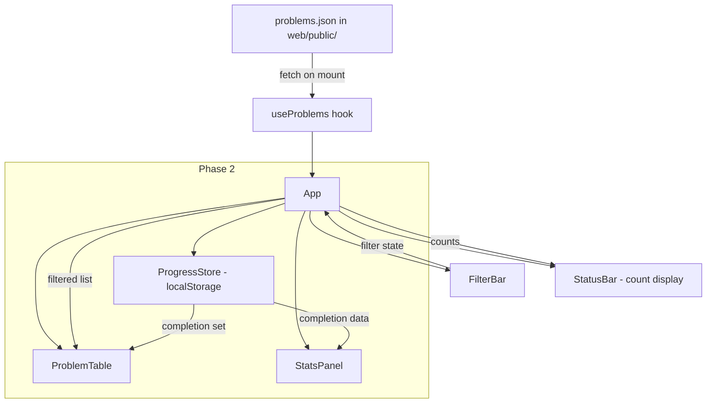

# Design Document: Study Tracker UI

## Overview

A static React single-page application that reads `problems.json` (115 coding interview problems) and renders a filterable, searchable dashboard. The app lives in `web/` inside the existing Java repo and deploys to GitHub Pages. There is no backend — all runtime state is client-side, and persistence (Phase 2) uses localStorage.

### Key Design Decisions

- **Vite + React**: Vite provides fast dev builds and a clean static output (`vite build`) that maps directly to GitHub Pages. No SSR, no framework overhead.
- **Single data source**: `problems.json` is copied into `web/public/` at build time (or symlinked). The app fetches it once on mount via `fetch()`.
- **Pure filtering logic separated from UI**: Filter functions are plain TypeScript functions (no React dependency) so they can be unit-tested and property-tested without a DOM.
- **Phase 2 deferred**: localStorage progress tracking and stats components are stubbed in the architecture but not designed in detail here. The interfaces are defined so Phase 1 code doesn't block Phase 2.

## Architecture



The app follows a top-down data flow:

1. `App` fetches and owns the full problem list via `useProblems()`.
2. `FilterBar` controls filter state (pattern, difficulty, company). State lives in `App` and is passed down.
3. `App` applies filter functions to produce a filtered list, passed to `ProblemTable`.
4. `StatusBar` shows `"Showing X of Y problems"`.
5. Phase 2 adds `ProgressStore` (a thin localStorage wrapper) and `StatsPanel`.

### Project Structure

```
web/
├── public/
│   └── problems.json          # copied from repo root
├── src/
│   ├── App.tsx                 # root component, state owner
│   ├── main.tsx                # Vite entry point
│   ├── components/
│   │   ├── FilterBar.tsx
│   │   ├── ProblemTable.tsx
│   │   └── StatusBar.tsx
│   ├── hooks/
│   │   └── useProblems.ts      # fetch + parse problems.json
│   ├── lib/
│   │   ├── filter.ts           # pure filtering functions
│   │   └── types.ts            # ProblemEntry type, filter state type
│   └── index.css               # minimal styles
├── index.html
├── vite.config.ts
├── tsconfig.json
└── package.json
```

## Components and Interfaces

### ProblemEntry (data shape — mirrors problems.json)

```typescript
interface ProblemEntry {
  name: string;
  pattern: string;
  subPattern: string | null;
  difficulty: "Easy" | "Medium" | "Hard";
  companies: string[];
  path: string;
  sourceUrl: string;
}
```

### FilterState

```typescript
interface FilterState {
  pattern: string | null;    // null = show all
  difficulty: string | null; // null = show all
  company: string | null;    // null = show all
}
```

### App (root component)

- State: `problems: ProblemEntry[]`, `filters: FilterState`, `loading: boolean`, `error: string | null`
- On mount: calls `useProblems()` which fetches and parses `problems.json`.
- Derives `filteredProblems` by calling `applyFilters(problems, filters)`.
- Derives dropdown options (`patterns`, `companies`) from the full problem list.
- Renders: `FilterBar`, `StatusBar`, `ProblemTable`.

### FilterBar

```typescript
interface FilterBarProps {
  patterns: string[];
  difficulties: string[];
  companies: string[];
  filters: FilterState;
  onFilterChange: (filters: FilterState) => void;
}
```

- Three `<select>` dropdowns (pattern, difficulty, company), each with an "All" default option.
- On mobile (< 768px), dropdowns stack vertically via CSS.

### ProblemTable

```typescript
interface ProblemTableProps {
  problems: ProblemEntry[];
}
```

- Renders a `<table>` with columns: Name, Pattern, Sub-Pattern, Difficulty, Companies.
- Name column: if `sourceUrl !== "TBD"`, renders as `<a href={sourceUrl} target="_blank" rel="noopener noreferrer">`. Otherwise plain text.
- On mobile, the table container gets `overflow-x: auto` for horizontal scroll.

### StatusBar

```typescript
interface StatusBarProps {
  visibleCount: number;
  totalCount: number;
}
```

- Renders: `"Showing {visibleCount} of {totalCount} problems"`.

### useProblems hook

```typescript
function useProblems(): {
  problems: ProblemEntry[];
  loading: boolean;
  error: string | null;
}
```

- Fetches `problems.json` from the public directory on mount.
- Returns loading/error/data states.

### Filter functions (pure, in `lib/filter.ts`)

```typescript
function applyFilters(problems: ProblemEntry[], filters: FilterState): ProblemEntry[];
function extractPatterns(problems: ProblemEntry[]): string[];
function extractCompanies(problems: ProblemEntry[]): string[];
```

- `applyFilters`: returns problems matching ALL active filters (logical AND). A `null` filter field means "no constraint".
- `extractPatterns`: returns sorted unique pattern values.
- `extractCompanies`: returns sorted unique company names flattened from all `companies` arrays.

### Phase 2 interfaces (stubbed, not implemented in Phase 1)

```typescript
// lib/progressStore.ts
interface ProgressStore {
  getCompleted(): Set<string>;
  markCompleted(name: string): void;
  markIncomplete(name: string): void;
}
```

## Data Models

### problems.json schema

Each entry in the JSON array:

| Field       | Type              | Notes                                      |
|-------------|-------------------|---------------------------------------------|
| name        | string            | Unique problem identifier (snake_case)      |
| pattern     | string            | e.g. `"01_arrays_and_strings"`, `"05_graphs"` |
| subPattern  | string \| null    | e.g. `"sliding_window"`, `"dfs"`, or `null` |
| difficulty  | string            | One of `"Easy"`, `"Medium"`, `"Hard"`       |
| companies   | string[]          | May be empty `[]`                           |
| path        | string            | Relative path to solution in repo           |
| sourceUrl   | string            | URL or `"TBD"`                              |

### Observed patterns (12 categories)

`01_arrays_and_strings`, `02_linked_lists`, `03_stacks_and_queues`, `04_trees`, `05_graphs`, `06_sorting_and_searching`, `07_dynamic_programming`, `08_binary_search`, `09_heaps_and_priority_queues`, `10_tries`, `11_design`, `12_greedy`

### Filter state (in-memory)

No persistence in Phase 1. Filter state resets on page reload.

### Phase 2: localStorage schema (high-level)

Key: `study-tracker-completed`
Value: JSON-serialized array of problem name strings.

Details to be finalized when Phase 2 is designed.

### Vite / GitHub Pages configuration

- `vite.config.ts` sets `base` to the GitHub Pages subpath (e.g. `/<repo-name>/`).
- `vite build` outputs to `web/dist/`, which is the deploy target.
- `problems.json` in `web/public/` is served as-is by Vite and included in the build output.

## Correctness Properties

*A property is a characteristic or behavior that should hold true across all valid executions of a system — essentially, a formal statement about what the system should do. Properties serve as the bridge between human-readable specifications and machine-verifiable correctness guarantees.*

### Property 1: Filter correctness (AND semantics)

*For any* array of ProblemEntry records and *for any* FilterState (where each field is either null or a value present in the data), `applyFilters(problems, filters)` should return exactly the entries that match ALL active (non-null) filter conditions simultaneously. Specifically:
- Every returned entry has `entry.pattern === filters.pattern` (if pattern is non-null)
- Every returned entry has `entry.difficulty === filters.difficulty` (if difficulty is non-null)
- Every returned entry has `filters.company` in `entry.companies` (if company is non-null)
- No entry satisfying all conditions is omitted from the result

**Validates: Requirements 1.2, 2.2, 2.3, 3.2, 3.3, 4.2, 4.3, 5.1**

### Property 2: Pattern extraction completeness

*For any* array of ProblemEntry records, `extractPatterns(problems)` should return a sorted array containing exactly the set of distinct `pattern` values present in the input — no duplicates, no missing values, no invented values.

**Validates: Requirements 2.1**

### Property 3: Company extraction completeness

*For any* array of ProblemEntry records, `extractCompanies(problems)` should return a sorted array containing exactly the set of distinct company names found across all `companies` arrays in the input — no duplicates, no missing values, no invented values.

**Validates: Requirements 4.1**

### Property 4: Visible and total count invariant

*For any* array of ProblemEntry records and *for any* FilterState, the visible count should equal the length of `applyFilters(problems, filters)` and the total count should equal the length of the original problems array.

**Validates: Requirements 5.2**

### Property 5: Source link rendering

*For any* ProblemEntry, the name should be rendered as a hyperlink if and only if `sourceUrl !== "TBD"`. When rendered as a link, it should open in a new tab and point to the `sourceUrl` value.

**Validates: Requirements 6.1, 6.2**

### Property 6: ProgressStore round-trip (Phase 2)

*For any* sequence of `markCompleted` and `markIncomplete` operations on arbitrary problem names, reading back via `getCompleted()` should return exactly the set of names that were marked completed and not subsequently marked incomplete.

**Validates: Requirements 7.2, 7.3, 7.4**

### Property 7: Stats computation correctness (Phase 2)

*For any* array of ProblemEntry records and *for any* set of completed problem names, the computed statistics should satisfy:
- Overall percentage = `completedCount / totalCount`
- For each pattern, the pattern completion count equals the number of entries with that pattern whose name is in the completed set
- For each difficulty, the difficulty completion count equals the number of entries with that difficulty whose name is in the completed set

**Validates: Requirements 8.1, 8.2, 8.3**

### Property 8: Problem table renders all required fields

*For any* ProblemEntry, the rendered table row should contain the entry's name, pattern, subPattern (or a placeholder if null), difficulty, and companies.

**Validates: Requirements 1.4**

## Scalability & Evolution

The current architecture is designed to scale gracefully as the problem set grows, with clear migration paths when static storage hits its limits.

**Where static JSON holds up:**
- `problems.json` at 115 entries is ~25KB. Even at 1,000 problems it'd be ~200KB — browsers fetch and filter that in milliseconds. In-memory filtering with `Array.filter()` is O(n) and stays sub-millisecond up to tens of thousands of entries. No pagination or virtualization needed until well past 1,000 problems.

**Where it starts to strain:**
- **Data updates**: Adding a problem currently means editing `classification.json`, re-running `generate_docs.py`, committing, and redeploying. Fine for a solo contributor, but friction grows with frequency.
- **Progress portability**: localStorage is device-locked. No cross-device sync, no sharing.
- **Multi-user**: If others want to track their own progress on the same problem set, localStorage can't scope per-user.

**Evolution path (no UI rewrites needed):**

| Trigger | Migration | What changes | What stays the same |
|---|---|---|---|
| Data updates get tedious | Add a build-time pipeline (e.g., Google Sheet → JSON, or a simple CMS) | How `problems.json` is produced | Everything — the app still reads the same static file |
| Cross-device progress | Swap `ProgressStore` implementation from localStorage to Firebase/Supabase | `lib/progressStore.ts` internals | `ProgressStore` interface, all UI components, filter logic |
| Multi-user support | Add auth + per-user storage (Firebase Auth + Firestore, or Supabase) | `ProgressStore` + add auth context | Filter logic, ProblemTable, FilterBar, data model |
| 1,000+ problems, slow rendering | Add virtualized table (e.g., `@tanstack/react-virtual`) | `ProblemTable` internals | Data fetching, filtering, all other components |

The key abstractions that enable this are `useProblems()` (data source) and `ProgressStore` (persistence). Both are interfaces — swap the implementation, keep the contract.

## Error Handling

| Scenario | Behavior |
|---|---|
| `problems.json` fetch fails (network error, 404) | `useProblems` sets `error` state. App renders an error message instead of the table. No crash. |
| `problems.json` contains invalid JSON | Same as above — caught in the parse step. |
| `problems.json` is valid JSON but wrong shape | TypeScript types catch this at build time for known issues. At runtime, missing fields render as empty/fallback. |
| Empty `problems.json` (`[]`) | Dashboard renders an empty table with "Showing 0 of 0 problems". Filter dropdowns are empty. |
| `companies` array is empty for an entry | Company column shows nothing. Entry is excluded from company-filtered results (correct behavior). |
| `subPattern` is null | Table cell shows "—" or is left blank. |
| `sourceUrl` is `"TBD"` | Name rendered as plain text, not a link (Requirement 6.2). |
| localStorage unavailable (Phase 2) | ProgressStore falls back to in-memory set. Warning displayed. Progress lost on reload. |
| localStorage data corrupted (Phase 2) | ProgressStore resets to empty set. Warning displayed. |

## Testing Strategy

### Testing Stack

- **Unit / integration tests**: Vitest (ships with Vite, zero-config for React + TypeScript)
- **Property-based tests**: [fast-check](https://github.com/dubzzz/fast-check) (the standard PBT library for TypeScript/JavaScript)
- **Component tests** (if needed): Vitest + React Testing Library

### Property-Based Tests

Each correctness property maps to a single `fast-check` test. Minimum 100 iterations per property.

Tests target the pure logic in `lib/filter.ts` and (Phase 2) `lib/progressStore.ts` — no DOM required.

Tag format for each test:

```
// Feature: study-tracker-ui, Property 1: Filter correctness (AND semantics)
```

Generators needed:
- `arbitraryProblemEntry()`: generates a ProblemEntry with random name, pattern (from the 12 known values), subPattern (string or null), difficulty (Easy/Medium/Hard), companies (array of 0-3 random strings), path, sourceUrl (random URL or "TBD").
- `arbitraryFilterState(problems)`: given a problems array, generates a FilterState where each field is either null or a value actually present in the data.
- `arbitraryCompletionSet(problems)`: generates a random subset of problem names.

### Unit Tests

Unit tests cover specific examples and edge cases not suited to property testing:

- Loading `problems.json` successfully returns all 115 entries (example, Req 1.1)
- Fetch failure shows error message (example, Req 1.3)
- Invalid JSON shows error message (example, Req 1.3)
- Difficulty dropdown contains exactly Easy, Medium, Hard (example, Req 3.1)
- localStorage unavailable shows warning (example, Req 7.5 — Phase 2)
- Empty problems array renders empty table (edge case)
- Entry with empty companies array excluded from company filter (edge case)

### Test Organization

```
web/src/
├── lib/
│   ├── filter.ts
│   ├── filter.test.ts          # unit + property tests for filtering
│   ├── filter.property.test.ts # property-only tests (fast-check)
│   └── types.ts
```

Phase 2 adds:
```
│   ├── progressStore.ts
│   ├── progressStore.test.ts
│   └── stats.test.ts
```
